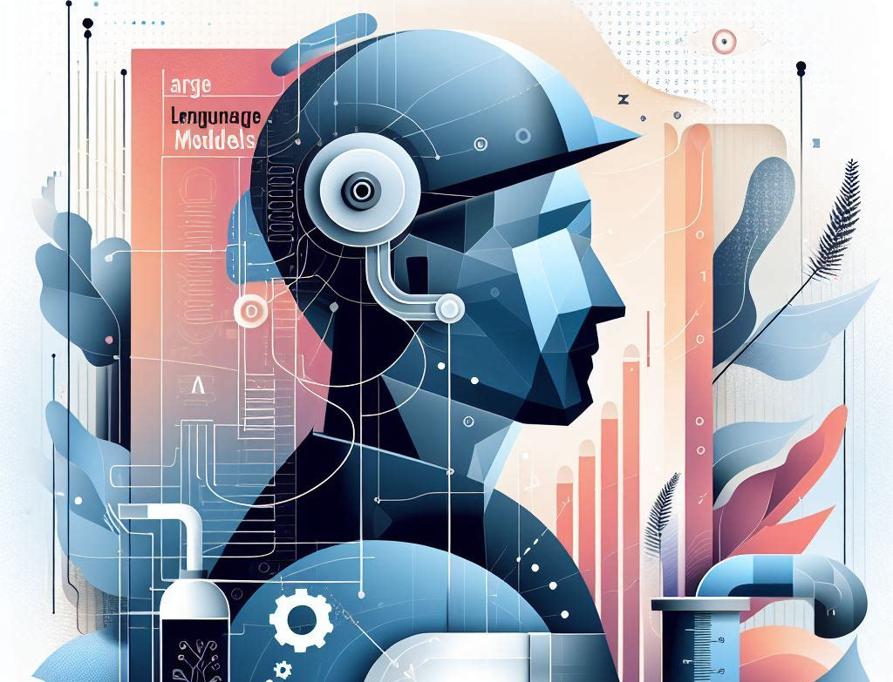

# About this blog

  This blog is part of my plan for my sabbatical year (2024- 2025). During which I will document my journey of dabbling into the world of LLMs and GenAI, and trying to find out how (or whether) this potentially transformative new technology could finally fundamentally transform teaching and learning (or not?) 

  Hopefully someone with similar background will find some of the posts useful for learning to use LLMs.

  I will also share my thoughts as I take time to dive into learning literature, and try to find answers to a seemingly simple question that has really been bugging me for quite a while: 

  
*How do we know whether someone knows something?*

  
I'll explain in detail why this is such a hard problem in detail in future blogposts.

## About *"Learning Plumber"*

You might have heard about the title "Learning Engineers": people who develop and deploy tools for learning. As a physics education researcher, I don't think I know enough to develop new tools, but I do love to take whatever tools the engineers created, and make sure that the STEM pipeline flows smoothly and don't leak as much as it does today. So a "Learning Plumber" is a suitable name for this blog :)

## About myself
(An introduction of myself which I still need to write)
---

This site is apparently still a work in progress, as I'm learning to build Github pages. 
