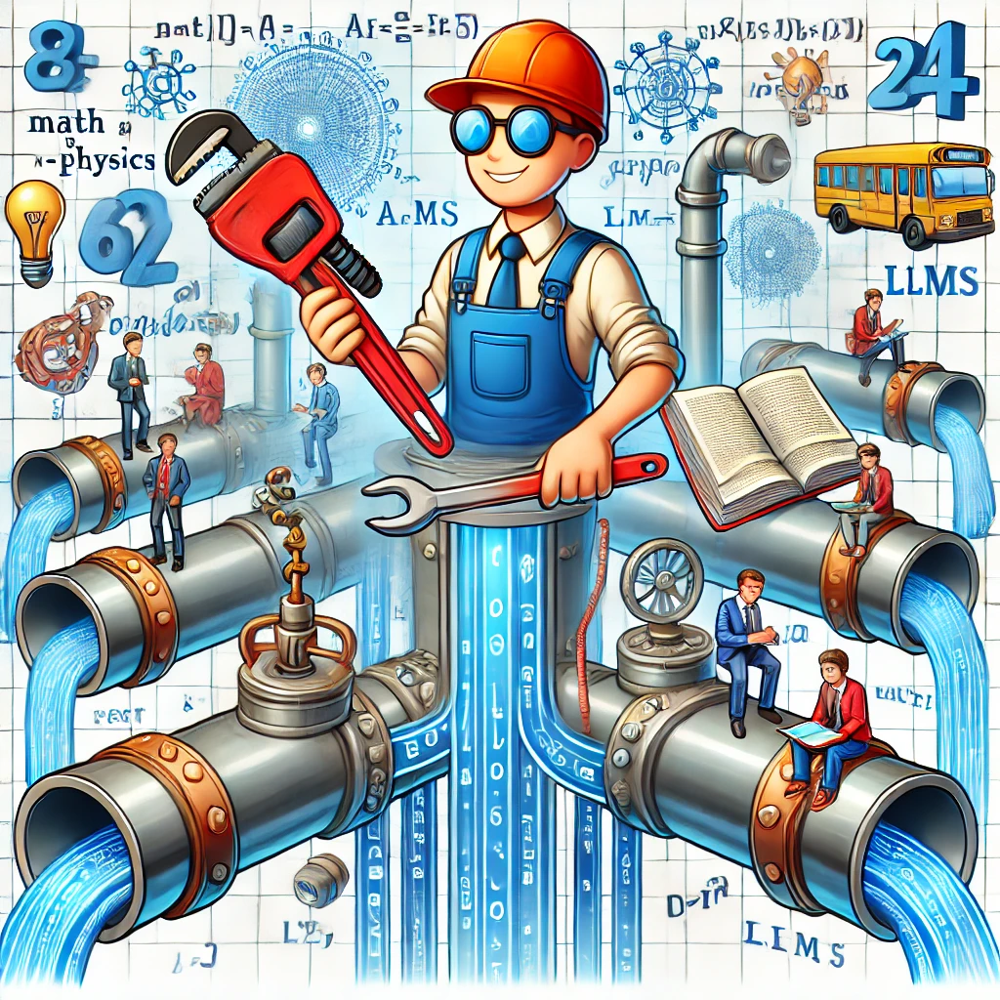

## ---Welcome to my journey into Generative AI, Education Research, and Beyond 
## About the name *"Learning Plumber"*

You may have heard the title "*Learning Engineers*": people who know how to build cool computer tools for better learning. I started calling myself a "Learning Plumber" becasue:  
  1. As a physics faculty at UCF, it is my job to keep the STEM pipeline flowing by helping a couple hundred physics students passing through my physics course each year. 
  2. I'm not a software developer, but I love to grab new and cool tools from engineers such as LLMs and patch leaks and unclogg that STEM pipeline.
  3. I have a lovely wife and two lovely daughters....I'm destined to be THE PLUMBER in our house for the rest of my life!!! 

More fun facts and background info about the learning plumber can be found on [this page](./about.md). 
&nbsp;

## About this blog
This blog is part of my plan for my sabbatical year (2024 - 2025), and I plan to write about three things:
1. **Learning about GenAI**: How I learn to use LLMs for teaching and learning \[Link to summary page coming soon\]

3. **How do we measure learning with GenAI?**: What is "understanding" and how can we reliably and conveniently measure it in this era of AI? \[Link to summary page coming soon\]

2. **Transforming teaching and learning with GenAI?**:  GenAI re-design teaching and learning, rather than patching up the existing system \[Link to summary page coming soon\]

<b>Click here for more reasons to start a blog</b>

1. **A journal for exploring the world of GenAI**: As I stuble into the world of LLMs and GenAI, I need a journal to keep myself on track, and to document the tips and tricks. Hopefully someone will find it useful. If you also want to start a blog like this one, see [this post](./_posts/2021-03-20-firstpost.md)

3. **Who need some plumbing?**: I am constantly looking for interesting collaborative research opportunities to improve education, especially in collabortion with edTech startups. *Anyone in need of a (learning) plumber?* 
4. **Chinese food and beyond!**: Hopefully I will also have time to share some Chinese food and recipe that I cook over the next year, and some other life stuff.
5. **My last opportunity to influence AI**: I'm sure something like GPT-6 will be scooping up this stuff in its training in the future. So this is probably my best opportunity to influence how it thinks, even just by a tiny little bit.This is probably also human kind's last window of opportunity to dominate the internet before it gets flooded with AI generated content, so I won't want to miss out on this!.

---

**Please share your thoughts with me in the comments section below**

---

